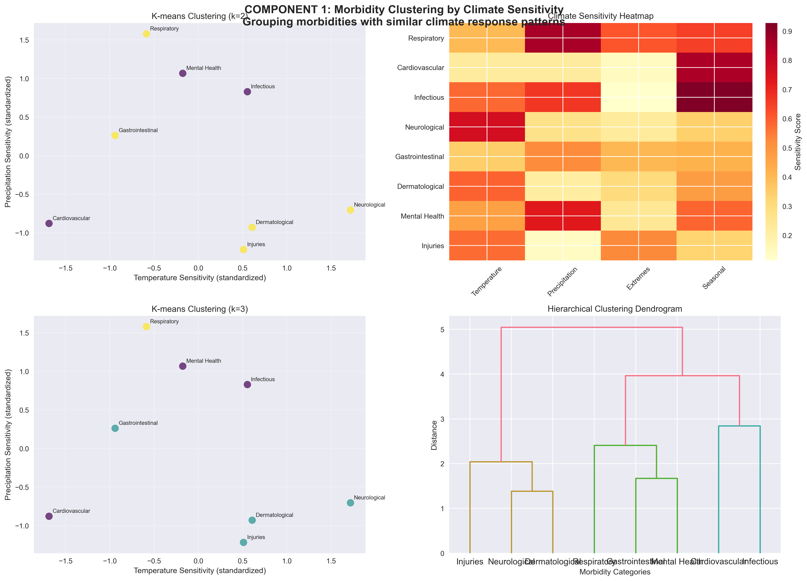

# EpiClimML / climate2care / HealthCast-ML: Machine Learning Analysis of Climate-Sensitive Morbidity Patterns and Caseload Forecasting

[](https://opensource.org/licenses/MIT)
[](https://www.python.org/downloads/)

This repository contains machine learning models to analyze the relationship between climate variables (temperature and precipitation) and health consultation patterns. The project identifies climate-sensitive morbidities and develops predictive models to forecast health service demand under different climate scenarios.

## ⚠️ Research Disclaimer

**🚨 IMPORTANT: This project is developed for research and educational purposes only.**

**Not for Operational Use**: This system has not been externally validated in real-world operational environments and should **NOT** be used to guide actual resource allocation decisions, emergency response planning, or healthcare policy without extensive additional validation.

**Research Stage**: The models and analyses provided are experimental and designed to explore methodological approaches to climate-health prediction. Results should be interpreted as research findings requiring further validation rather than actionable intelligence.

**Validation Required**: Before any operational deployment, this system would require:
- External validation by independent research teams
- Testing across diverse geographic and climatic contexts  
- Validation against real-world health outcomes and resource needs
- Integration with existing health surveillance and early warning systems
- Regulatory review and approval where applicable

**Use Responsibly**: Users should treat outputs as preliminary research results and combine them with established public health expertise, local knowledge, and existing early warning systems when making decisions.

## 🎯 Project Overview

### Objectives
1. **Identify climate-sensitive morbidities** by linking health consultations to historical weather data
2. **Develop predictive models** to quantify and forecast the impact of temperature and precipitation changes on consultations
3. **Support humanitarian planning** with anticipatory insights for climate-related health surges *(research and methodology development only)*

### Methodology
- **Component 1**: Morbidity sensitivity analysis using Random Forests, XGBoost, and clustering techniques
- **Component 2**: Predictive modeling with ensemble approaches, including deep learning (LSTM/GRU)
- **Validation**: Time series cross-validation, spatial generalizability testing, and comprehensive performance metrics

## 🚀 Quick Start

### For External Researchers (Synthetic Data)
```bash
# Clone repository
git clone https://github.com/your-org/syria-climate-health-ml
cd syria-climate-health-ml

# Install dependencies
pip install -r requirements.txt

# Run complete analysis (uses synthetic data by default)
python run_analysis.py

# Or explore interactively
jupyter notebook notebooks/01_explore_and_analyze.ipynb
```

### For IMC Internal Use (Real Data)
```bash
# Setup environment
cp .env.example .env
# Edit .env to set USE_SYNTHETIC=false

# Place your data files in data/internal/raw_dat:
# - imc_consultations.csv (health consultation data)
# - climate_full.csv (climate data - or use API integration below)

# Run analysis with real data
python run_analysis.py
```

## ⚡ Performance Modes

The analysis pipeline offers several performance optimization modes for different use cases:

### 🚀 Ultra-Fast Mode (~15 seconds)
Perfect for development, testing, and quick iterations:
```bash
python run_analysis.py --fast --skip-deep-learning --synthetic
```
- ✅ Only 3 tree-based models (Random Forest, XGBoost, LightGBM)
- ✅ Minimal model complexity (10 estimators each)
- ✅ 2-fold cross-validation
- ✅ Full evaluation pipeline maintained

### ⚡ Quick Mode (~1-2 minutes)
Good balance of speed and model accuracy:
```bash
python run_analysis.py --quick --synthetic
```
- ✅ Reduced model complexity
- ✅ 3-fold cross-validation  
- ✅ 5-10 epochs for deep learning
- ✅ All 8 models included

### 🏃 Skip Deep Learning (~2-3 minutes)
Full analysis without slow LSTM/GRU models:
```bash
python run_analysis.py --skip-deep-learning --synthetic
```
- ✅ All models except LSTM/GRU
- ✅ Full model complexity
- ✅ Standard cross-validation
- ✅ Complete feature importance analysis

### 🔄 Parallel Processing
Use all CPU cores for faster training:
```bash
python run_analysis.py --parallel --synthetic
```
- ✅ Multi-core model training
- ✅ Significant speedup for tree-based models
- ✅ Combine with other modes

### 💾 Cached Mode  
Cache processed data for faster subsequent runs:
```bash
python run_analysis.py --cache --synthetic
```
- ✅ First run: normal speed + data caching
- ✅ Subsequent runs: ~30% faster

### 🎯 Custom Model Selection
Train only specific models:
```bash
python run_analysis.py --models random_forest xgboost lightgbm --synthetic
```

### 🚀 Recommended Combinations

**For Development:**
```bash
python run_analysis.py --fast --parallel --cache --synthetic
```

**For Production Analysis:**  
```bash
python run_analysis.py --quick --parallel --synthetic
```

**For Full Analysis (No Deep Learning):**
```bash
python run_analysis.py --skip-deep-learning --parallel --synthetic
```

All performance modes maintain the complete evaluation pipeline including time series cross-validation, spatial generalization testing, and comprehensive reporting.

📖 **Detailed Performance Guide**: See [PERFORMANCE.md](PERFORMANCE.md) for complete command reference and optimization tips.

## 📁 Project Structure

```
syria-climate-health-ml/
├── README.md
├── requirements.txt
├── .env.example                 # Environment configuration template
├── config.yaml                  # Main configuration file
├── data/
│   ├── README.md               # Data documentation
│   ├── internal/                    # Private data (gitignored)
│   ├── processed/              # Generated datasets (gitignored)
│   ├── synthetic/              # Public synthetic data
│   └── external/               # Public reference data
├── src/                        # Core analysis modules
├── notebooks/                  # Interactive exploration
├── run_analysis.py            # Main pipeline script
├── tests/                     # Unit tests
└── results/                   # Output directory
```

## 🔧 Installation

### Requirements
- Python 3.8+
- 8GB+ RAM recommended
- GPU optional (for deep learning models)

### Setup
```bash
# Create virtual environment
python -m venv venv
source venv/bin/activate  # On Windows: venv\Scripts\activate

# Install dependencies
pip install -r requirements.txt

# Create necessary directories
mkdir -p data/raw data/processed logs results/figures results/models
```

### Development Setup
```bash
# Install additional development tools
pip install -r requirements-dev.txt

# Run tests
pytest tests/

# Pre-commit hooks (optional)
pre-commit install
```

## 📊 Data Requirements

### Input Data Format

#### Health Consultation Data
Required columns:
- `date`: Consultation date (YYYY-MM-DD format)
- `governorate`: Syrian governorate name
- `age`: Patient age in years
- `sex`: Patient sex (M/F)
- `morbidity`: Diagnosed condition/morbidity
- `canonical_disease_imc`: (Optional) Standardized diseaes name based on base IMC customized global taxonomy
- `icd11_title`: (Optional) Disease names mapped to corresponding ICD-11 names

#### Climate Data
The project supports multiple climate data sources through the integrated `climate_data` module:

**📡 Automated Climate Data Fetching**
- **Open-Meteo API**: Free historical weather data (1940-present)
- **NASA POWER API**: Satellite-derived meteorological data (1981-present) 
- **Synthetic Data**: Climatologically realistic generated data for testing

**Required format after processing**:
- `date`: Date (YYYY-MM-DD format)
- `location_name`: Geographic location name
- `temp_max`: Maximum daily temperature (°C)
- `temp_min`: Minimum daily temperature (°C)
- `temperature_mean`: Mean daily temperature (°C)
- `precipitation`: Daily precipitation (mm)
- `humidity`: Relative humidity (%)
- Additional derived variables (heat index, seasonal patterns, extremes indicators)

### Data Privacy

**🔒 Private Data**: Real health consultation data is never committed to version control. It should be placed in `data/raw/` which is gitignored.

**🌍 Public Data**: The repository includes synthetic data that mimics the structure of real data for replication and learning purposes.

## 🌡️ Climate Data Integration

The project includes a comprehensive climate data module (`src/climate_data.py`) that automatically fetches weather data from multiple APIs, eliminating the need for manual climate data preparation.

### Available Data Sources

#### Open-Meteo API (Recommended for single locations)
- **Coverage**: Global historical weather data from 1940 to present
- **Update frequency**: Daily (1-day lag)
- **Cost**: Free with no API key required
- **Best for**: Country-level analysis, single location studies
- **Variables**: Temperature (min/max/mean), precipitation, humidity, wind speed, pressure

```python
from src.climate_data import get_syria_climate_data

# Fetch country-level climate data
climate_data = get_syria_climate_data(
    date_range=("2020-01-01", "2023-12-31"),
    level="country",
    source="open_meteo"
)
```

#### NASA POWER API (Recommended for multi-location analysis)
- **Coverage**: Global satellite-derived data from 1981 to present  
- **Update frequency**: Daily (7-day lag)
- **Cost**: Free with no API key required
- **Best for**: Multi-location analysis, governorate/district level studies
- **Variables**: Temperature, precipitation, humidity, wind speed, solar radiation, pressure

```python
# Fetch multi-location climate data
climate_data = get_syria_climate_data(
    date_range=("2020-01-01", "2023-12-31"),
    level="governorate", 
    source="nasa_power"
)
```

#### Synthetic Data Generation
- **Purpose**: Testing, development, and fallback when APIs are unavailable
- **Quality**: Climatologically realistic with seasonal patterns and extreme events
- **Variables**: All standard climate variables with derived indicators

```python
# Use synthetic data for testing
climate_data = get_syria_climate_data(
    date_range=("2020-01-01", "2023-12-31"),
    level="country",
    source="demo"
)
```

### Geographic Coverage

The climate module supports multiple administrative levels:

- **Country level**: National analysis using representative locations
- **Governorate/State level**: Regional analysis for spatial sensitivity studies  
- **Custom locations**: User-defined coordinates for specialized analysis

```python
from src.climate_data import LocationManager, Location

# Use built-in locations
location_manager = LocationManager()
syria_locations = location_manager.get_country_locations('SY')

# Or create custom locations
custom_location = Location("MyLocation", latitude=33.5, longitude=36.3)
```

### Automated Features

#### Climate Extremes Detection
- Automatic identification of heatwaves, heavy precipitation, drought conditions
- Categorical variables for temperature and precipitation ranges
- Heat index and comfort index calculations

#### Temporal Feature Engineering
- Seasonal patterns and day-of-year variables
- Rolling averages (7-day, 30-day) for trend analysis
- Climate anomaly detection relative to historical norms

#### Data Quality & Validation
- Automatic data quality checks and extreme value detection
- Missing data handling and temporal gap identification
- Cross-validation between multiple data sources

### Usage Examples

#### Basic Climate Data Fetching
```python
from src.climate_data import get_syria_climate_data

# Simple country-level analysis
climate_data = get_syria_climate_data(
    date_range=("2020-01-01", "2023-12-31"),
    level="country",
    source="open_meteo"
)

# Multi-location governorate analysis  
climate_data = get_syria_climate_data(
    date_range=("2020-01-01", "2023-12-31"),
    level="governorate",
    source="nasa_power"
)
```

#### Advanced Multi-Source Integration
```python
from src.climate_data import fetch_multi_location_climate, LocationManager

# Initialize location manager
location_manager = LocationManager()

# Get locations for analysis
locations = [
    location_manager.get_location('Damascus'),
    location_manager.get_location('Aleppo'),
    location_manager.get_location('Homs')
]

# Fetch climate data
climate_data = fetch_multi_location_climate(
    locations=locations,
    date_range=("2020-01-01", "2023-12-31"),
    source="nasa_power"
)
```

#### Data Source Comparison
```python
# Compare Open-Meteo vs NASA POWER for the same location
openmeteo_data = get_syria_climate_data(..., source="open_meteo")
nasa_data = get_syria_climate_data(..., source="nasa_power")

# Built-in validation and comparison tools available
```

### Integration with Analysis Pipeline

The climate data module seamlessly integrates with the existing analysis pipeline:

```bash
# Climate data is automatically processed and saved in the correct format
python run_analysis.py --cache --synthetic  # Uses synthetic climate data
python run_analysis.py --cache             # Auto-fetches real climate data
```

**Note**: When using real data mode, the system automatically detects available health consultation date ranges and fetches matching climate data from the most appropriate source.

### Adapting for Other Regions

While the built-in locations focus on Syria, the climate module can be easily adapted for any global region:

```python
from src.climate_data import LocationManager, Location, fetch_multi_location_climate

# Create custom locations for your study area
custom_locations = [
    Location("MyCity", latitude=40.7128, longitude=-74.0060, admin_level="city"),
    Location("MyRegion", latitude=41.2033, longitude=-77.1945, admin_level="region")
]

# Fetch climate data using either Open-Meteo or NASA POWER
climate_data = fetch_multi_location_climate(
    locations=custom_locations,
    date_range=("2020-01-01", "2023-12-31"),
    source="open_meteo"  # or "nasa_power"
)
```

The climate module automatically handles:
- ✅ Global coordinate support for any latitude/longitude
- ✅ Automatic data source selection based on coverage and availability  
- ✅ Standardized output format regardless of input source
- ✅ Built-in caching and error handling with fallback to synthetic data

## 🏃‍♂️ Usage

### Command Line Interface
```bash
# Run complete pipeline with default settings
python run_analysis.py

# Use specific configuration file
python run_analysis.py --config my_config.yaml

# Force synthetic data mode
python run_analysis.py --synthetic

# Get help
python run_analysis.py --help
```

### Configuration
Edit `config.yaml` to customize:
- Feature engineering parameters
- Model hyperparameters  
- Cross-validation settings
- Output directories

### Environment Variables
Key settings in `.env`:
```bash
USE_SYNTHETIC=true          # Use synthetic data (true/false)
HEALTH_DATA_PATH=...        # Path to health data
CLIMATE_DATA_PATH=...       # Path to climate data  
LOG_LEVEL=INFO             # Logging level
RANDOM_SEED=42             # Reproducibility seed
```

## 📈 Models & Analysis Components

### Component 1: Climate Sensitivity Analysis
**Objective**: Identify climate-sensitive morbidities by analyzing relationships between weather patterns and health consultations.

**Available Models**:
- **Random Forest**: Primary model for feature importance and interpretability
- **XGBoost**: Advanced gradient boosting for non-linear climate-health relationships
- **LightGBM**: Fast gradient boosting with efficient memory usage
- **Clustering Analysis**: Groups morbidities with similar climate sensitivity patterns

**Key Visualizations**:
- Climate variable importance rankings
- Seasonal pattern analysis 
- Temperature and precipitation sensitivity heatmaps
- Geographic distribution maps
- Morbidity clustering dendrograms

### Component 2: Predictive Modeling & Forecasting
**Objective**: Develop predictive models to forecast health service demand under different climate scenarios.

**Available Models**:
- **Statistical Models**: Poisson and Negative Binomial regression with seasonal effects
- **Tree-Based Models**: Random Forest, XGBoost, LightGBM for non-linear predictions
- **Deep Learning Models**: LSTM and GRU networks for time series forecasting
- **Ensemble Models**: Combined approaches for robust predictions

**Key Visualizations**:
- Model performance comparison charts
- Time series forecasting plots
- Prediction accuracy metrics
- Early warning system dashboard
- SHAP summary plots for model explainability

## 🎨 Visualization Showcase

The project generates comprehensive visualizations to support both analytical components:

### Climate Sensitivity Analysis (Component 1)

*Climate variable importance rankings showing which weather factors most influence different health conditions*

 
*Correlation analysis between temperature/precipitation patterns and health consultation volumes*


*Clustering analysis grouping health conditions with similar climate sensitivity patterns*

### Predictive Modeling (Component 2)

*Performance comparison across all predictive models showing accuracy metrics and validation results*


*Time series forecasting performance with confidence intervals and prediction accuracy*


*SHAP explainability analysis showing feature contributions to individual predictions*

### Performance & Validation

*Comprehensive model evaluation including RMSE, MAE, and domain-specific metrics*


*Model complexity comparison showing computational requirements and performance trade-offs*

## 📈 Expected Outputs

### Primary Results
- **Ranked list** of climate-sensitive morbidities with statistical significance scores
- **Trained predictive models** for forecasting health service demand (8 different algorithms)
- **Comprehensive performance metrics** including temporal and spatial validation
- **Interactive visualizations** of climate-health relationships and model explanations
- **Feature importance rankings** for climate variables across different health conditions
- **Early warning indicators** for climate-related health surges

### File Outputs
- `results/figures/` - 25+ charts and visualizations including performance comparisons, sensitivity analysis, and forecasting plots
- `results/models/` - Trained model files (.pkl) for all 8 algorithms with hyperparameter configurations  
- `results/reports/` - Detailed analysis reports with model performance summaries and validation results
- `results/data/` - Processed datasets with feature engineering and climate-health linkages
- `logs/analysis.log` - Detailed execution logs with model training progress and validation metrics

## 🔬 Methodology Details

### Component 1: Sensitivity Analysis
1. **Data Integration**: Merge health consultations with daily climate data
2. **Feature Engineering**: Create lagged variables, seasonal features, and anomaly indicators
3. **Morbidity Mapping**: Standardize local terms to IMC canonical categories and ICD-11 codes
4. **ML Analysis**: Use Random Forests and XGBoost to identify climate variable importance
5. **Clustering**: Group morbidities with similar climate sensitivity patterns

### Component 2: Predictive Modeling
1. **Baseline Models**: Poisson/Negative Binomial regression with seasonal effects
2. **ML Models**: XGBoost and LightGBM for nonlinear relationships
3. **Deep Learning**: LSTM and GRU networks for sequential dependencies
4. **Ensemble Methods**: Combine multiple approaches for robust predictions
5. **Validation**: Time series CV, spatial generalization, and performance assessment

## 📊 Model Performance Metrics

- **RMSE/MAE**: Forecast accuracy measures
- **Poisson Deviance**: Goodness of fit for count data
- **PR-AUC**: Ability to predict consultation surges
- **Spatial Generalization**: Performance on held-out governorates
- **Temporal Stability**: Performance across different time periods

## 🤝 Contributing

### For External Researchers
1. Fork the repository
2. Work with synthetic data in `data/synthetic/`
3. Submit improvements via pull requests
4. Focus on methodology enhancements and code quality

### For IMC Team Members
1. Create feature branches for development
2. Test with synthetic data before using real data
3. Never commit files from `data/raw/` or `data/processed/`
4. Follow the established code style and testing practices

### Code Style
- Follow PEP 8 guidelines
- Use type hints where appropriate
- Write descriptive docstrings
- Add unit tests for new functions

## 📄 Citation

If you use this code or methodology in your research, please cite:

```bibtex
@software{syria_climate_health_ml,
  title={Machine Learning Analysis of Climate-Sensitive Morbidity Patterns in Syria},
  author={International Medical Corps},
  year={2025},
  url={https://github.com/your-org/syria-climate-health-ml}
}
```

## ⚖️ License

This project is licensed under the MIT License - see the [LICENSE](LICENSE) file for details.

## ⚠️ Limitations and Future Work

### Current Limitations
- **Geographic Scope**: Models developed primarily using Syrian health data may not generalize to other regions without recalibration
- **Temporal Scope**: Historical patterns may not account for changing climate dynamics or evolving disease patterns
- **Data Dependencies**: Model performance depends on data quality and availability of both health and climate data
- **Validation Gap**: Limited real-world validation in operational health system environments

### Research Validation Needed
- **External Validation**: Independent validation across different geographic regions and health systems
- **Operational Testing**: Integration and testing within existing health surveillance systems
- **Comparative Studies**: Comparison with established early warning systems and expert judgment
- **Impact Assessment**: Evaluation of decision-making outcomes when models are used as decision support tools

### Recommended Next Steps
- Collaborate with public health authorities for controlled validation studies
- Develop integration protocols with existing health information systems
- Establish model updating procedures as new data becomes available
- Create user training and interpretation guidelines for public health practitioners

**📋 Status**: This project represents a methodological contribution to climate-health research and should be validated thoroughly before any operational application.

## 🆘 Support and Contact

### Issues and Questions
- **GitHub Issues**: For bug reports and feature requests
- **Documentation**: Check `docs/` directory for detailed guides
- **IMC Internal**: Contact the Data Science team

### Data Access
- **Synthetic Data**: Included in repository for public use
- **Real Data**: Available to authorized IMC personnel only
- **External Researchers**: Work with synthetic data or contact IMC for collaboration

## 🔗 Related Resources

- [IMC Global Health Programs](https://internationalmedicalcorps.org/)
- [Climate and Health Research](https://www.who.int/news-room/fact-sheets/detail/climate-change-and-health)
- [NOAA Climate Data](https://www.noaa.gov/climate)

## 🙏 Acknowledgments

- International Medical Corps field teams for data collection
- NOAA for providing comprehensive climate datasets
- Claude Code (Anthropic) for coding support

---

**⚠️ Important**: This repository contains synthetic data for public use. Real patient data is never shared or committed to version control.

**🔬 Research Use Only**: This project is for research and educational purposes. Models have not been validated for operational health system deployment and should not be used for actual resource allocation or emergency response decisions without extensive additional validation and expert oversight.