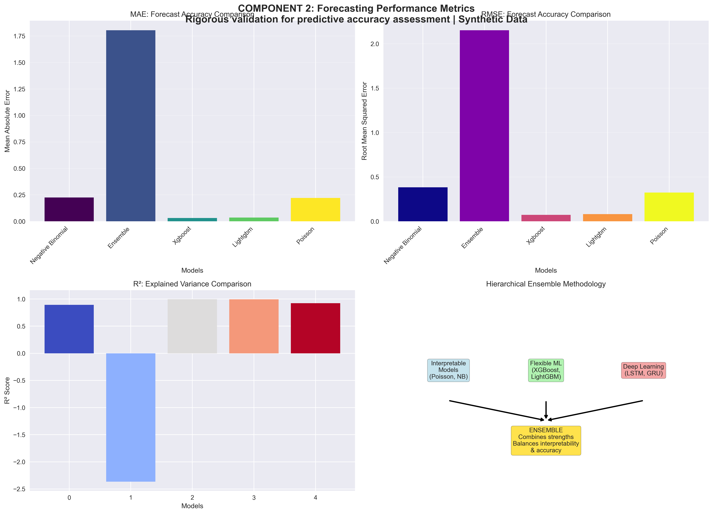
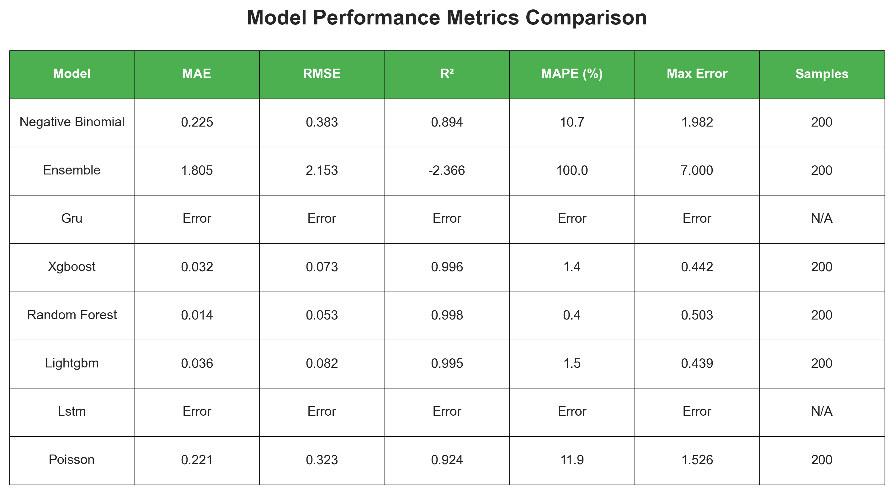
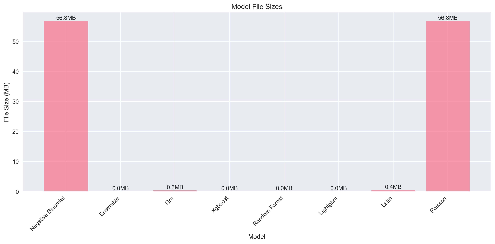

# HealthCast-ML: Machine Learning Analysis of Climate-Sensitive Morbidity Patterns and Caseload Forecasting

[](https://opensource.org/licenses/MIT)
[](https://www.python.org/downloads/)

This repository contains machine learning models to analyze the relationship between climate variables (temperature and precipitation) and health consultation patterns. The project identifies climate-sensitive morbidities and develops predictive models to forecast health service demand under different climate scenarios.

## 🎯 Project Overview

### Objectives
1. **Identify climate-sensitive morbidities** by linking health consultations to historical weather data
2. **Develop predictive models** to quantify and forecast the impact of temperature and precipitation changes on consultations
3. **Support humanitarian planning** with anticipatory insights for climate-related health surges *(research and methodology development only)*

### Methodology
- **Component 1**: Morbidity sensitivity analysis using Random Forests, XGBoost, and clustering techniques
- **Component 2**: Predictive modeling with ensemble approaches, including deep learning (LSTM/GRU)
- **Validation**: Time series cross-validation, spatial generalizability testing, and comprehensive performance metrics

## 🌍 Ultimate Goal: Supporting Resource Planning

This project provides the analytical foundation for climate-informed health resource planning:

```
📊 Historical Data → 🔬 ML Analysis → 📈 Predictive Models → 📋 Planning Insights
┌─────────────────┐  ┌──────────────┐  ┌─────────────────┐  ┌──────────────────┐
│ Climate &       │  │ Sensitivity  │  │ Forecasting     │  │ Resource         │
│ Health Records  │→ │ Analysis     │→ │ Models          │→ │ Planning         │
│                 │  │              │  │                 │  │ Support          │
│ • Temperature   │  │ • Identify   │  │ • Predict       │  │ • Staff          │
│ • Precipitation │  │   climate-   │  │   demand        │  │   allocation     │
│ • Consultations │  │   sensitive  │  │   surges        │  │ • Supply         │
│ • Morbidities   │  │   conditions │  │ • Quantify      │  │   preparation    │
└─────────────────┘  │ • Rank risks │  │   uncertainty   │  │ • Early warning  │
                     └──────────────┘  └─────────────────┘  │   systems        │
                                                            └──────────────────┘
```

**Key Benefits for Humanitarian Planning:**
- 🎯 **Anticipatory insights** - Forecast health surges before they occur
- 📊 **Evidence-based decisions** - Quantify climate-health relationships
- ⚡ **Early warning capability** - Identify periods of elevated health risk
- 🎛️ **Resource optimization** - Allocate staff and supplies based on predicted demand
- 🌡️ **Climate adaptation** - Prepare health systems for changing climate patterns

*Note: This project focuses on research methodology development. Operational deployment requires additional validation and stakeholder engagement.*

## 🚀 Quick Start

### For External Researchers (Synthetic Data)
```bash
# Clone repository
git clone https://github.com/your-org/syria-climate-health-ml
cd syria-climate-health-ml

# Install dependencies
pip install -r requirements.txt

# Run complete analysis (uses synthetic data by default)
python run_analysis.py

# Or explore interactively
jupyter notebook notebooks/01_explore_and_analyze.ipynb
```

### For IMC Internal Use (Real Data)
```bash
# Setup environment
cp .env.example .env
# Edit .env to set USE_SYNTHETIC=false

# Place your data files in data/internal/raw_dat:
# - imc_consultations.csv (health consultation data)
# - climate_full.csv (climate data - or use API integration below)

# Run analysis with real data
python run_analysis.py
```

## ⚡ Performance Modes

The analysis pipeline offers several performance optimization modes:

- **Ultra-Fast**: `--fast` (~15 seconds, development)
- **Quick**: `--quick` (~1-2 minutes, balanced)  
- **Skip Deep Learning**: `--skip-deep-learning` (~2-3 minutes, faster)
- **Parallel**: `--parallel` (use all CPU cores)
- **Cached**: `--cache` (30% faster subsequent runs)

### Recommended Usage
```bash
# For development
python run_analysis.py --fast --parallel --cache --synthetic

# For production analysis  
python run_analysis.py --quick --parallel --synthetic

# For complete analysis
python run_analysis.py --skip-deep-learning --parallel --synthetic
```

📖 **Complete Guide**: See [PERFORMANCE.md](PERFORMANCE.md) for all optimization options and command combinations.

## 📁 Project Structure

```
HealthCast-ML/
├── README.md                    # Project documentation
├── requirements.txt             # Python dependencies
├── .env.example                 # Environment configuration template
├── config.yaml                  # Main configuration file
├── run_analysis.py             # Main analysis pipeline script
├── view_results.py             # Results visualization and analysis
├── manage_cache.py             # Cache management utilities
├── 
├── src/                        # Core analysis modules
│   ├── climate_data.py        # Climate data fetching and processing
│   ├── data_processing.py     # Health data processing and validation
│   ├── feature_engineering.py # Feature creation and transformation
│   ├── models.py              # Machine learning models (8 algorithms)
│   ├── evaluation.py          # Model evaluation and validation
│   ├── utils.py               # Utility functions and visualizations
│   ├── taxonomy_processor.py  # Disease classification processing
│   ├── taxonomy_cache.py      # Disease taxonomy caching
│   └── open_meteo_processor.py # Open-Meteo API integration
├── 
├── data/                       # Data storage (see .gitignore for excluded files)
│   ├── README.md              # Data documentation and formats
│   ├── synthetic/             # Public synthetic data for testing
│   │   └── generate_synthetic.py # Synthetic data generation
│   └── external/              # Public reference data
│       └── governorate_mapping.json # Geographic mappings
├── 
├── taxonomy/                   # Disease classification taxonomies
│   ├── base.yaml              # Base disease taxonomy
│   ├── syria.yaml             # Syria-specific mappings
│   └── icd11/                 # ICD-11 disease mappings
│       └── disease_mappings.yml
├── 
├── results/                    # Analysis outputs
│   └── figures/               # Generated visualizations (25+ charts)
├── 
├── tests/                      # Unit and integration tests
│   ├── test_data_processing.py # Data processing tests
│   ├── test_models.py         # Model testing
│   └── test_synthetic_data.py # Synthetic data validation
├── 
├── scripts/                    # Utility and maintenance scripts
│   ├── analyze_syria_facilities.py # Facility analysis
│   ├── conversation_persistence.py # Session management
│   └── system_stability.py    # System monitoring
├── 
└── examples/                   # Usage examples and tutorials
    └── climate_data_integration_example.py # API integration examples
```

## 🔧 Installation

### Quick Setup
```bash
# Clone and setup
git clone https://github.com/your-org/climate-health-ml
cd climate-health-ml
python -m venv venv
source venv/bin/activate
pip install -r requirements.txt

# Run analysis
python run_analysis.py --synthetic --fast
```

📖 **Detailed Guide**: See [INSTALL.md](INSTALL.md) for system requirements, development setup, troubleshooting, and platform-specific instructions.

## 📊 Data Requirements

### Input Data Format

#### Health Consultation Data

**Required input columns**:
- `date`: Consultation date (YYYY-MM-DD format)
- `admin1`: Administrative level 1 (governorate/state/province name)  
- `morbidity`: Diagnosed condition/morbidity in local terminology
- `age_group`: Patient age group category
- `sex`: Patient sex (M/F)

**Optional input columns** (enhance analysis if present):
- `admin0`, `admin2`, `admin3`: Additional administrative levels for geographic granularity
- `age_group_new`, `age_group2`, `age_group3`, `age_group4`: Alternative age groupings
- `orgunit`: Health facility organizational unit identifier
- `facility_type`: Type of health facility (hospital, clinic, etc.)

**Generated columns** (created during processing):
- `canonical_disease_imc`: Standardized disease names using IMC global taxonomy (generated from `morbidity` using taxonomy functions)
- `icd11_title`: ICD-11 disease classifications (generated from `morbidity` using disease mapping functions)

**Optional metadata files** (enhance geographic and facility analysis):
- Facility metadata with geographic coordinates and facility details
- Administrative boundary mappings and population data
- Custom disease taxonomy files for region-specific terminology

#### Climate Data
The project automatically fetches climate data from multiple APIs:
- **Open-Meteo API**: Free historical weather (1940-present)
- **NASA POWER API**: Satellite meteorological data (1981-present)
- **Synthetic Data**: Climatologically realistic for testing

📖 **Detailed Guide**: See [data/README.md](data/README.md) for API integration examples, multi-source setup, and region adaptation.

### Data Privacy
**🔒 Private Data**: Real health consultation data is gitignored in `data/raw/`
**🌍 Public Data**: Synthetic data included for replication and learning

## 🚀 Quick Start

```bash
# Run with synthetic data (no setup required)
python run_analysis.py --synthetic --fast

# View results
python view_results.py --summary
```

#### Open-Meteo API (Recommended for single locations)
- **Coverage**: Global historical weather data from 1940 to present
- **Update frequency**: Daily (1-day lag)
- **Cost**: Free with no API key required
- **Best for**: Country-level analysis, single location studies
- **Variables**: Temperature (min/max/mean), precipitation, humidity, wind speed, pressure

```python
from src.climate_data import get_syria_climate_data

# Fetch country-level climate data
climate_data = get_syria_climate_data(
    date_range=("2020-01-01", "2023-12-31"),
    level="country",
    source="open_meteo"
)
```

#### NASA POWER API (Recommended for multi-location analysis)
- **Coverage**: Global satellite-derived data from 1981 to present  
- **Update frequency**: Daily (7-day lag)
- **Cost**: Free with no API key required
- **Best for**: Multi-location analysis, governorate/district level studies
- **Variables**: Temperature, precipitation, humidity, wind speed, solar radiation, pressure

```python
# Fetch multi-location climate data
climate_data = get_syria_climate_data(
    date_range=("2020-01-01", "2023-12-31"),
    level="governorate", 
    source="nasa_power"
)
```

#### Synthetic Data Generation
- **Purpose**: Testing, development, and fallback when APIs are unavailable
- **Quality**: Climatologically realistic with seasonal patterns and extreme events
- **Variables**: All standard climate variables with derived indicators

```python
# Use synthetic data for testing
climate_data = get_syria_climate_data(
    date_range=("2020-01-01", "2023-12-31"),
    level="country",
    source="demo"
)
```

### Geographic Coverage

The climate module supports multiple administrative levels:

- **Country level**: National analysis using representative locations
- **Governorate/State level**: Regional analysis for spatial sensitivity studies  
- **Custom locations**: User-defined coordinates for specialized analysis

```python
from src.climate_data import LocationManager, Location

# Use built-in locations
location_manager = LocationManager()
syria_locations = location_manager.get_country_locations('SY')

# Or create custom locations
custom_location = Location("MyLocation", latitude=33.5, longitude=36.3)
```

### Automated Features

#### Climate Extremes Detection
- Automatic identification of heatwaves, heavy precipitation, drought conditions
- Categorical variables for temperature and precipitation ranges
- Heat index and comfort index calculations

#### Temporal Feature Engineering
- Seasonal patterns and day-of-year variables
- Rolling averages (7-day, 30-day) for trend analysis
- Climate anomaly detection relative to historical norms

#### Data Quality & Validation
- Automatic data quality checks and extreme value detection
- Missing data handling and temporal gap identification
- Cross-validation between multiple data sources

### Usage Examples

#### Basic Climate Data Fetching
```python
from src.climate_data import get_syria_climate_data

# Simple country-level analysis
climate_data = get_syria_climate_data(
    date_range=("2020-01-01", "2023-12-31"),
    level="country",
    source="open_meteo"
)

# Multi-location governorate analysis  
climate_data = get_syria_climate_data(
    date_range=("2020-01-01", "2023-12-31"),
    level="governorate",
    source="nasa_power"
)
```

#### Advanced Multi-Source Integration
```python
from src.climate_data import fetch_multi_location_climate, LocationManager

# Initialize location manager
location_manager = LocationManager()

# Get locations for analysis
locations = [
    location_manager.get_location('Damascus'),
    location_manager.get_location('Aleppo'),
    location_manager.get_location('Homs')
]

# Fetch climate data
climate_data = fetch_multi_location_climate(
    locations=locations,
    date_range=("2020-01-01", "2023-12-31"),
    source="nasa_power"
)
```

#### Data Source Comparison
```python
# Compare Open-Meteo vs NASA POWER for the same location
openmeteo_data = get_syria_climate_data(..., source="open_meteo")
nasa_data = get_syria_climate_data(..., source="nasa_power")

# Built-in validation and comparison tools available
```


### Adapting for Other Regions

While the built-in locations focus on Syria, the climate module can be easily adapted for any global region:

```python
from src.climate_data import LocationManager, Location, fetch_multi_location_climate

# Create custom locations for your study area
custom_locations = [
    Location("MyCity", latitude=40.7128, longitude=-74.0060, admin_level="city"),
    Location("MyRegion", latitude=41.2033, longitude=-77.1945, admin_level="region")
]

# Fetch climate data using either Open-Meteo or NASA POWER
climate_data = fetch_multi_location_climate(
    locations=custom_locations,
    date_range=("2020-01-01", "2023-12-31"),
    source="open_meteo"  # or "nasa_power"
)
```

The climate module automatically handles:
- ✅ Global coordinate support for any latitude/longitude
- ✅ Automatic data source selection based on coverage and availability  
- ✅ Standardized output format regardless of input source
- ✅ Built-in caching and error handling with fallback to synthetic data

## 🏃‍♂️ Usage

### Command Line Interface
```bash
# Run complete pipeline with default settings
python run_analysis.py

# Use specific configuration file
python run_analysis.py --config my_config.yaml

# Force synthetic data mode
python run_analysis.py --synthetic

# Get help
python run_analysis.py --help
```

### Configuration
Edit `config.yaml` to customize:
- Feature engineering parameters
- Model hyperparameters  
- Cross-validation settings
- Output directories

### Environment Variables
Key settings in `.env`:
```bash
USE_SYNTHETIC=true          # Use synthetic data (true/false)
HEALTH_DATA_PATH=...        # Path to health data
CLIMATE_DATA_PATH=...       # Path to climate data  
LOG_LEVEL=INFO             # Logging level
RANDOM_SEED=42             # Reproducibility seed
```

## 📈 Models & Analysis Components

### Component 1: Climate Sensitivity Analysis
**Objective**: Identify climate-sensitive morbidities by analyzing relationships between weather patterns and health consultations.

**Available Models**:
- **Random Forest**: Primary model for feature importance and interpretability
- **XGBoost**: Advanced gradient boosting for non-linear climate-health relationships
- **LightGBM**: Fast gradient boosting with efficient memory usage
- **Clustering Analysis**: Groups morbidities with similar climate sensitivity patterns

**Key Visualizations**:
- Climate variable importance rankings
- Seasonal pattern analysis 
- Temperature and precipitation sensitivity heatmaps
- Geographic distribution maps
- Morbidity clustering dendrograms

### Component 2: Predictive Modeling & Forecasting
**Objective**: Develop predictive models to forecast health service demand under different climate scenarios.

**Available Models**:
- **Statistical Models**: Poisson and Negative Binomial regression with seasonal effects
- **Tree-Based Models**: Random Forest, XGBoost, LightGBM for non-linear predictions
- **Deep Learning Models**: LSTM and GRU networks for time series forecasting
- **Ensemble Models**: Combined approaches for robust predictions

**Key Visualizations**:
- Model performance comparison charts
- Time series forecasting plots
- Prediction accuracy metrics
- Early warning system dashboard
- SHAP summary plots for model explainability

## 🎨 Visualization Showcase

The project generates comprehensive visualizations to support both analytical components:

### Climate Sensitivity Analysis (Component 1)

*Climate variable importance rankings showing which weather factors most influence different health conditions*

 
*Correlation analysis between temperature/precipitation patterns and health consultation volumes*


*Clustering analysis grouping health conditions with similar climate sensitivity patterns*

### Predictive Modeling (Component 2)

*Performance comparison across all predictive models showing accuracy metrics and validation results*


*Time series forecasting performance with confidence intervals and prediction accuracy*


*SHAP explainability analysis showing feature contributions to individual predictions*

### Performance & Validation

*Comprehensive model evaluation including RMSE, MAE, and domain-specific metrics*


*Model complexity comparison showing computational requirements and performance trade-offs*

## 📈 Expected Outputs

### Primary Results
- **Ranked list** of climate-sensitive morbidities with statistical significance scores
- **Trained predictive models** for forecasting health service demand (8 different algorithms)
- **Comprehensive performance metrics** including temporal and spatial validation
- **Interactive visualizations** of climate-health relationships and model explanations
- **Feature importance rankings** for climate variables across different health conditions
- **Early warning indicators** for climate-related health surges

### File Outputs
- `results/figures/` - 25+ charts and visualizations including performance comparisons, sensitivity analysis, and forecasting plots
- `results/models/` - Trained model files (.pkl) for all 8 algorithms with hyperparameter configurations  
- `results/reports/` - Detailed analysis reports with model performance summaries and validation results
- `results/data/` - Processed datasets with feature engineering and climate-health linkages
- `logs/analysis.log` - Detailed execution logs with model training progress and validation metrics

## 🔬 Methodology Details

### Component 1: Sensitivity Analysis
1. **Data Integration**: Merge health consultations with daily climate data
2. **Feature Engineering**: Create lagged variables, seasonal features, and anomaly indicators
3. **Morbidity Mapping**: Standardize local terms to IMC canonical categories and ICD-11 codes
4. **ML Analysis**: Use Random Forests and XGBoost to identify climate variable importance
5. **Clustering**: Group morbidities with similar climate sensitivity patterns

### Component 2: Predictive Modeling
1. **Baseline Models**: Poisson/Negative Binomial regression with seasonal effects
2. **ML Models**: XGBoost and LightGBM for nonlinear relationships
3. **Deep Learning**: LSTM and GRU networks for sequential dependencies
4. **Ensemble Methods**: Combine multiple approaches for robust predictions
5. **Validation**: Time series CV, spatial generalization, and performance assessment

## 📊 Model Performance Metrics

- **RMSE/MAE**: Forecast accuracy measures
- **Poisson Deviance**: Goodness of fit for count data
- **PR-AUC**: Ability to predict consultation surges
- **Spatial Generalization**: Performance on held-out governorates
- **Temporal Stability**: Performance across different time periods

## ⚖️ License

This project is licensed under the MIT License - see the [LICENSE](LICENSE) file for details.

## 🆘 Support and Contact

### Issues and Questions
- **GitHub Issues**: For bug reports and feature requests
- **Documentation**: Check `docs/` directory for detailed guides
- **IMC Internal**: Contact the M&E team

### Data Access
- **Synthetic Data**: Included in repository for public use
- **Real Data**: Available to authorized IMC personnel only
- **External Researchers**: Work with synthetic data or contact IMC for collaboration

## 🔗 Related Resources

- [IMC Global Health Programs](https://internationalmedicalcorps.org/)
- [Climate and Health Research](https://www.who.int/news-room/fact-sheets/detail/climate-change-and-health)
- [NOAA Climate Data](https://www.noaa.gov/climate)

## 🙏 Acknowledgments

- International Medical Corps field teams for data collection
- NOAA and Open-Meteo efor providing comprehensive climate datasets
- Claude Code (Anthropic) for coding support

---

**⚠️ Important**: This repository contains synthetic data for public use. Real patient data is never shared or committed to version control.

**🔬 Research Use Only**: This project is for research and educational purposes. Models have not been validated for operational health system deployment and should not be used for actual resource allocation or emergency response decisions without extensive additional validation and expert oversight.